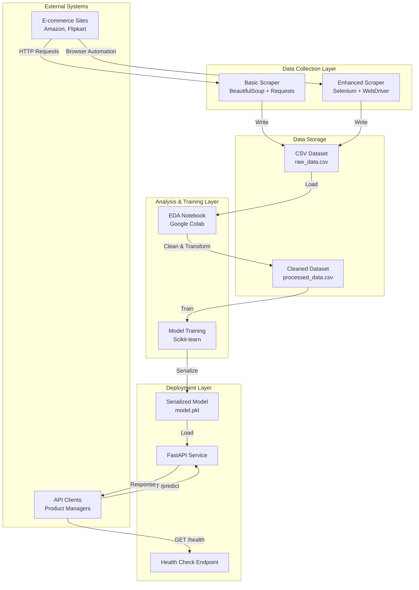

# Design Document: Bluetooth Headphones Price Prediction System

## Overview

The Bluetooth Headphones Price Prediction System is a data-driven solution for the Indian e-commerce market that combines web scraping, machine learning, and API deployment to provide intelligent pricing recommendations. The system extracts product data from e-commerce platforms, processes and analyzes this data, trains regression models to understand pricing patterns, and exposes predictions through a REST API.

### System Goals

- **Data Acquisition**: Scrape at least 100 Bluetooth headphone products from Indian e-commerce platforms with complete specifications
- **Price Prediction**: Achieve R-squared ≥ 0.70 on test data for price predictions
- **Real-time Inference**: Provide price predictions within 2 seconds via API
- **Maintainability**: Support model updates without service downtime

### Key Design Decisions

1. **Dual Scraping Approach**: Implement both basic (BeautifulSoup + Requests) and enhanced (Selenium) scrapers to handle static and dynamic content
2. **Framework Selection**: Use FastAPI over Flask for deployment due to automatic validation, async support, and better performance
3. **Model Choice**: Start with ensemble methods (Random Forest, Gradient Boosting) rather than simple linear regression for better handling of non-linear relationships
4. **Storage Format**: Use CSV for scraped data (human-readable, easy EDA) and pickle for model serialization

## Architecture

### System Components



### Data Flow

1. **Scraping Phase**: Scrapers extract product data from e-commerce sites and write to CSV
2. **Analysis Phase**: EDA notebook loads raw CSV, performs cleaning, feature engineering, and creates train/test splits
3. **Training Phase**: ML pipeline trains on processed data, evaluates performance, and serializes the best model
4. **Deployment Phase**: FastAPI service loads the serialized model and serves predictions via REST endpoints
5. **Inference Phase**: Clients send feature sets via POST requests and receive price predictions

### Technology Stack

| Component | Technology | Justification |
|-----------|-----------|---------------|
| Basic Scraper | BeautifulSoup 4 + Requests | Lightweight, fast for static HTML, low resource usage |
| Enhanced Scraper | Selenium + ChromeDriver | Handles JavaScript-rendered content, can interact with dynamic elements |
| Data Analysis | Pandas, NumPy, Matplotlib, Seaborn | Industry standard for data manipulation and visualization |
| ML Framework | Scikit-learn | Comprehensive regression algorithms, easy model persistence |
| API Framework | FastAPI | Automatic validation via Pydantic, async support, OpenAPI docs |
| Model Serialization | Pickle/Joblib | Native Python serialization, compatible with scikit-learn |
| Deployment | Uvicorn ASGI server | High-performance async server for FastAPI |

## Components and Interfaces

### 1. Basic Scraper Component

**Purpose**: Extract product data from static HTML pages on e-commerce platforms.

**Technology**: Python with BeautifulSoup4, Requests, lxml parser

**Key Classes**:

```python
class BasicScraper:
    """Scrapes static e-commerce pages for headphone data."""
    
    def __init__(self, base_url: str, headers: dict):
        """Initialize with target URL and request headers."""
        
    def fetch_page(self, url: str) -> BeautifulSoup:
        """Fetch and parse HTML page."""
        
    def extract_product_data(self, soup: BeautifulSoup) -> dict:
        """Extract product fields using XPath/CSS selectors."""
        
    def scrape_products(self, product_urls: list[str]) -> pd.DataFrame:
        """Scrape multiple products and return DataFrame."""
        
    def save_to_csv(self, df: pd.DataFrame, filepath: str):
        """Save scraped data to CSV file."""
```

**XPath Selectors** (examples for common e-commerce patterns):

```python
SELECTORS = {
    'product_name': "//h1[@class='product-title']//text()",
    'price': "//span[@class='price-value']//text()",
    'brand': "//a[@class='brand-link']//text()",
    'rating': "//span[@class='rating-value']//text()",
    'review_count': "//span[@class='review-count']//text()",
    'specifications': "//div[@class='spec-table']//tr",
    'battery_life': "//td[contains(text(), 'Battery')]/../td[2]//text()",
    'bluetooth_version': "//td[contains(text(), 'Bluetooth')]/../td[2]//text()",
    'noise_cancellation': "//td[contains(text(), 'Noise')]/../td[2]//text()",
}
```

**Error Handling**:
- Retry logic with exponential backoff for network failures
- Graceful degradation when optional fields are missing
- Logging of failed URLs to separate error file

**Output Format** (CSV):
```
product_name,brand,price,rating,review_count,battery_life,bluetooth_version,noise_cancellation,driver_size,frequency_response,url,scraped_at
```

### 2. Enhanced Scraper Component

**Purpose**: Handle JavaScript-rendered content and dynamic page elements using browser automation.

**Technology**: Selenium WebDriver with Chrome/ChromeDriver

**Key Classes**:

```python
class EnhancedScraper:
    """Scrapes dynamic e-commerce pages with JavaScript rendering."""
    
    def __init__(self, headless: bool = True):
        """Initialize Selenium WebDriver with Chrome options."""
        
    def wait_for_element(self, xpath: str, timeout: int = 10) -> WebElement:
        """Wait for element to be present and visible."""
        
    def extract_with_prompt_engineering(self, page_source: str) -> dict:
        """Use pattern matching to extract structured data from unstructured text."""
        
    def normalize_units(self, value: str, field: str) -> float:
        """Convert various unit formats to standard units."""
        
    def scrape_with_retry(self, url: str, max_retries: int = 3) -> dict:
        """Scrape with retry logic and error recovery."""
```

**Prompt Engineering Patterns**:

The enhanced scraper uses regex patterns and heuristics to extract data from unstructured text:

```python
EXTRACTION_PATTERNS = {
    'battery_life': r'(\d+)\s*(?:hours?|hrs?|h)\s*(?:battery|playback|music)',
    'bluetooth_version': r'bluetooth\s*(?:version)?\s*([0-9.]+)',
    'driver_size': r'(\d+)\s*mm\s*driver',
    'frequency_response': r'(\d+)\s*hz\s*-\s*(\d+)\s*(?:khz|hz)',
    'weight': r'(\d+)\s*(?:grams?|g)\s*weight',
}
```

**Data Normalization**:
- Battery life → hours (convert "30h", "30 hours", "1800 minutes")
- Bluetooth version → float (extract "5.0" from "Bluetooth v5.0")
- Driver size → mm (standardize "40mm", "40 mm", "4cm")
- Price → INR float (remove "₹", ",", handle "Rs.")

### 3. EDA and Data Preparation Component

**Purpose**: Analyze scraped data, handle missing values, engineer features, and prepare train/test datasets.

**Technology**: Google Colab notebook with Pandas, NumPy, Matplotlib, Seaborn, Scikit-learn

**Key Operations**:

```python
class DataPreparation:
    """Handles data cleaning and preparation for ML."""
    
    def load_data(self, filepath: str) -> pd.DataFrame:
        """Load CSV and perform initial inspection."""
        
    def handle_missing_values(self, df: pd.DataFrame) -> pd.DataFrame:
        """Impute or remove missing values based on strategy."""
        
    def remove_duplicates(self, df: pd.DataFrame) -> pd.DataFrame:
        """Identify and remove duplicate products."""
        
    def encode_categorical(self, df: pd.DataFrame) -> pd.DataFrame:
        """One-hot encode categorical features."""
        
    def normalize_numerical(self, df: pd.DataFrame) -> pd.DataFrame:
        """Scale numerical features using StandardScaler."""
        
    def create_train_test_split(self, df: pd.DataFrame, test_size: float = 0.2):
        """Split data into training and testing sets."""
```

**Missing Value Strategy**:
- **Brand**: Drop rows (critical feature)
- **Price**: Drop rows (target variable)
- **Battery Life**: Impute with median by brand
- **Bluetooth Version**: Impute with mode (most common version)
- **Noise Cancellation**: Fill with "No" (binary feature)
- **Rating/Reviews**: Impute with median or create "unknown" category
- **Driver Size/Frequency**: Impute with median or drop if >30% missing

**Feature Engineering**:
- Create `has_noise_cancellation` binary feature
- Create `price_per_hour` = price / battery_life
- Create `brand_tier` based on average brand price (budget/mid/premium)
- Extract `bluetooth_major_version` (4, 5, etc.)
- Create `high_rating` binary feature (rating >= 4.0)

**Visualization Requirements**:
- Price distribution histogram
- Price vs. battery life scatter plot
- Brand-wise price box plots
- Correlation heatmap of numerical features
- Missing value heatmap

### 4. Price Prediction Model Component

**Purpose**: Train regression models to predict headphone prices based on specifications.

**Technology**: Scikit-learn with multiple regression algorithms

**Model Pipeline**:

```python
class PricePredictionModel:
    """Trains and evaluates price prediction models."""
    
    def __init__(self):
        """Initialize with model candidates."""
        self.models = {
            'linear': LinearRegression(),
            'ridge': Ridge(alpha=1.0),
            'lasso': Lasso(alpha=1.0),
            'random_forest': RandomForestRegressor(n_estimators=100, random_state=42),
            'gradient_boosting': GradientBoostingRegressor(n_estimators=100, random_state=42),
        }
        
    def train_models(self, X_train, y_train):
        """Train all candidate models."""
        
    def evaluate_models(self, X_test, y_test) -> dict:
        """Evaluate models and return metrics."""
        
    def select_best_model(self, metrics: dict) -> object:
        """Select model with best R-squared score."""
        
    def get_feature_importance(self, model, feature_names: list) -> pd.DataFrame:
        """Extract and rank feature importance."""
        
    def save_model(self, model, filepath: str):
        """Serialize model using joblib."""
```

**Evaluation Metrics**:
- **R-squared (R²)**: Proportion of variance explained (target: ≥ 0.70)
- **RMSE (Root Mean Squared Error)**: Average prediction error in INR
- **MAE (Mean Absolute Error)**: Average absolute error in INR
- **MAPE (Mean Absolute Percentage Error)**: Percentage error

**Model Selection Criteria**:
1. R² ≥ 0.70 (requirement threshold)
2. Lowest RMSE among qualifying models
3. Feature importance interpretability
4. Inference speed (<100ms per prediction)

**Feature Importance**:
- Extract top 5 features contributing to price prediction
- Use `feature_importances_` for tree-based models
- Use coefficient magnitude for linear models

### 5. Deployment Service Component

**Purpose**: Expose trained model via REST API for real-time price predictions.

**Technology**: FastAPI with Pydantic validation, Uvicorn server

**API Structure**:

```python
from fastapi import FastAPI, HTTPException
from pydantic import BaseModel, Field
import joblib
import numpy as np

app = FastAPI(title="Headphone Price Predictor API", version="1.0.0")

class HeadphoneFeatures(BaseModel):
    """Input schema for price prediction."""
    brand: str = Field(..., description="Headphone brand name")
    battery_life: float = Field(..., gt=0, description="Battery life in hours")
    bluetooth_version: float = Field(..., ge=4.0, le=6.0, description="Bluetooth version")
    has_noise_cancellation: bool = Field(..., description="Active noise cancellation")
    driver_size: float = Field(None, gt=0, description="Driver size in mm (optional)")
    rating: float = Field(None, ge=0, le=5, description="Product rating (optional)")
    
class PricePrediction(BaseModel):
    """Output schema for price prediction."""
    predicted_price: float = Field(..., description="Predicted price in INR")
    model_version: str = Field(..., description="Model version used")
    confidence_interval: tuple[float, float] = Field(None, description="95% confidence interval")

class ModelService:
    """Manages model loading and predictions."""
    
    def __init__(self, model_path: str):
        """Load model and preprocessing pipeline."""
        self.model = joblib.load(model_path)
        self.version = self._extract_version(model_path)
        
    def preprocess_features(self, features: HeadphoneFeatures) -> np.ndarray:
        """Transform input features to model format."""
        
    def predict(self, features: HeadphoneFeatures) -> float:
        """Generate price prediction."""
        
    def reload_model(self, model_path: str):
        """Hot-reload model without downtime."""

@app.post("/predict", response_model=PricePrediction)
async def predict_price(features: HeadphoneFeatures):
    """Predict headphone price based on specifications."""
    
@app.get("/health")
async def health_check():
    """Health check endpoint with model status."""
    
@app.get("/model/info")
async def model_info():
    """Return model metadata and feature importance."""
```

**API Endpoints**:

1. **POST /predict**
   - Input: JSON with headphone features
   - Output: Predicted price in INR
   - Validation: Automatic via Pydantic
   - Timeout: 2 seconds max

2. **GET /health**
   - Output: Service status, model version, uptime
   - Use: Load balancer health checks

3. **GET /model/info**
   - Output: Model metadata, feature importance, training metrics
   - Use: Debugging and monitoring

**Error Handling**:
- 422 Unprocessable Entity: Invalid input features
- 500 Internal Server Error: Model prediction failure
- 503 Service Unavailable: Model not loaded

**Logging**:
- Log all prediction requests with timestamp
- Log input features (for monitoring drift)
- Log prediction latency
- Log errors with stack traces

## Data Models

### Scraped Product Schema

```python
@dataclass
class ScrapedProduct:
    """Raw product data from e-commerce scraping."""
    product_name: str
    brand: str
    price: float  # INR
    rating: Optional[float]  # 0-5 scale
    review_count: Optional[int]
    battery_life: Optional[float]  # hours
    bluetooth_version: Optional[float]  # e.g., 5.0
    noise_cancellation: Optional[bool]
    driver_size: Optional[float]  # mm
    frequency_response: Optional[str]  # e.g., "20Hz-20kHz"
    weight: Optional[float]  # grams
    url: str
    scraped_at: datetime
```

### Processed Feature Schema

```python
@dataclass
class ProcessedFeatures:
    """Cleaned and engineered features for ML."""
    # Original features
    brand_encoded: np.ndarray  # One-hot encoded
    battery_life: float
    bluetooth_version: float
    has_noise_cancellation: bool
    driver_size: float
    rating: float
    
    # Engineered features
    brand_tier: int  # 0=budget, 1=mid, 2=premium
    bluetooth_major_version: int
    price_per_hour: float
    high_rating: bool
    
    # Target
    price: float  # INR
```

### Model Metadata Schema

```python
@dataclass
class ModelMetadata:
    """Metadata for trained model."""
    model_type: str  # e.g., "RandomForestRegressor"
    version: str  # e.g., "1.0.0"
    trained_at: datetime
    training_samples: int
    test_samples: int
    r_squared: float
    rmse: float
    mae: float
    feature_names: list[str]
    feature_importance: dict[str, float]
    hyperparameters: dict
```

## Correctness Properties

*A property is a characteristic or behavior that should hold true across all valid executions of a system—essentially, a formal statement about what the system should do. Properties serve as the bridge between human-readable specifications and machine-verifiable correctness guarantees.*

Before defining properties, I need to analyze the acceptance criteria to determine which are suitable for property-based testing.


### Property 1: Data Serialization Round-Trip

*For any* valid scraped product data structure, serializing to CSV format and then deserializing should preserve all field values and data types.

**Validates: Requirements 1.2**

### Property 2: Unit Normalization Equivalence

*For any* set of equivalent values expressed in different units (e.g., "30h", "30 hours", "1800 minutes" for battery life), the normalization function should produce identical standardized output values.

**Validates: Requirements 2.4**

### Property 3: Missing Value Handling Completeness

*For any* dataset with missing values in non-required fields, after applying the missing value handling strategy, the resulting dataset should contain no missing values in core features (brand, price, battery_life, bluetooth_version, noise_cancellation).

**Validates: Requirements 3.3**

### Property 4: Deduplication Idempotence

*For any* dataset, applying the deduplication function multiple times should produce the same result as applying it once (i.e., deduplicate(deduplicate(data)) == deduplicate(data)).

**Validates: Requirements 3.4**

### Property 5: Train-Test Split Proportions

*For any* dataset with at least 10 samples, creating a train-test split with test_size=0.2 should result in the test set containing 20% (±1%) of the total samples and the train set containing the remaining 80% (±1%).

**Validates: Requirements 3.5**

### Property 6: Categorical Encoding Information Preservation

*For any* categorical feature with distinct values, after one-hot encoding, the number of encoded columns should equal the number of distinct categories, and decoding should recover the original category labels.

**Validates: Requirements 3.6**

### Property 7: Numerical Normalization Statistical Properties

*For any* numerical feature array, after applying StandardScaler normalization, the resulting array should have a mean approximately equal to 0 (within ±0.01) and standard deviation approximately equal to 1 (within ±0.01).

**Validates: Requirements 3.7**

### Property 8: Model Prediction Validity

*For any* valid feature set representing headphone specifications, the trained price prediction model should output a positive price value in the range [500, 50000] INR (reasonable bounds for Bluetooth headphones in the Indian market).

**Validates: Requirements 4.4**

### Property 9: Model Serialization Round-Trip

*For any* trained regression model and any valid feature set, serializing the model to disk and then deserializing it should produce identical predictions (within floating-point precision tolerance of 1e-6).

**Validates: Requirements 4.6**

### Property 10: API Response Time Bounds

*For any* valid feature set submitted to the prediction API endpoint, the response time should be less than 2000 milliseconds.

**Validates: Requirements 5.2**

### Property 11: API Input Validation Error Handling

*For any* invalid input (missing required fields, out-of-range values, wrong data types), the API should return a 422 Unprocessable Entity status code with a descriptive error message identifying the validation failure.

**Validates: Requirements 5.3**

## Error Handling

### Scraping Errors

**Network Failures**:
- Implement exponential backoff retry (3 attempts: 1s, 2s, 4s delays)
- Log failed URLs to `scraping_errors.log` with timestamp and error type
- Continue with remaining URLs after max retries exceeded
- Generate summary report showing success/failure counts

**Parsing Errors**:
- Catch exceptions during HTML parsing (malformed HTML, missing elements)
- Log product URL and specific parsing error
- Skip product and continue with next URL
- Track parsing success rate in summary report

**Rate Limiting**:
- Implement delays between requests (1-2 seconds)
- Detect 429 Too Many Requests responses
- Implement adaptive backoff when rate limited
- Respect robots.txt directives

### Data Processing Errors

**Missing Value Handling**:
- Define required vs. optional fields
- Drop rows with missing required fields (brand, price)
- Impute optional fields using strategy defined in Data Models section
- Log imputation statistics (count, method used)

**Data Type Errors**:
- Validate data types after scraping (price should be numeric, etc.)
- Attempt type coercion with error handling
- Log rows with type conversion failures
- Provide data quality report showing type issues

**Outlier Detection**:
- Identify price outliers using IQR method (Q1 - 1.5*IQR, Q3 + 1.5*IQR)
- Flag but don't automatically remove outliers
- Provide visualization of outliers for manual review
- Document outlier handling decisions

### Model Training Errors

**Insufficient Data**:
- Require minimum 100 samples for training
- Raise clear error if dataset too small
- Suggest scraping more products

**Poor Model Performance**:
- If R² < 0.70, log warning and suggest:
  - Collecting more data
  - Adding more features
  - Trying different algorithms
- Don't deploy models below performance threshold

**Feature Engineering Errors**:
- Handle division by zero in engineered features (e.g., price_per_hour)
- Validate feature ranges after engineering
- Log feature engineering statistics

### API Errors

**Model Loading Failures**:
- Catch exceptions during model deserialization
- Return 503 Service Unavailable if model not loaded
- Log detailed error for debugging
- Provide health check endpoint showing model status

**Prediction Errors**:
- Catch exceptions during model.predict()
- Return 500 Internal Server Error with generic message
- Log full stack trace and input features
- Implement circuit breaker pattern for repeated failures

**Input Validation**:
- Use Pydantic for automatic validation
- Return 422 with field-specific error messages
- Validate ranges (e.g., bluetooth_version between 4.0 and 6.0)
- Validate required vs. optional fields

**Timeout Handling**:
- Set 2-second timeout for predictions
- Return 504 Gateway Timeout if exceeded
- Log slow predictions for investigation

## Testing Strategy

### Unit Testing

**Scraping Components**:
- Test XPath selector extraction with mock HTML
- Test unit normalization functions with various formats
- Test error handling with simulated network failures
- Test CSV writing and reading with sample data
- Focus on specific examples and edge cases

**Data Processing**:
- Test missing value imputation strategies
- Test deduplication logic with known duplicates
- Test train-test split proportions
- Test categorical encoding/decoding
- Test numerical normalization
- Use example-based tests for specific scenarios

**Model Components**:
- Test model training with small synthetic dataset
- Test feature importance extraction
- Test model serialization/deserialization
- Test prediction output format
- Use mock data for fast execution

**API Components**:
- Test endpoint routing and request handling
- Test input validation with invalid inputs
- Test error response formats
- Test health check endpoint
- Use FastAPI TestClient for integration tests

### Property-Based Testing

The system is suitable for property-based testing in several areas where universal properties hold across many inputs:

**Testing Library**: Use `hypothesis` for Python property-based testing

**Test Configuration**: Minimum 100 iterations per property test

**Property Test Implementation**:

Each correctness property defined above should be implemented as a property-based test with the following tag format in comments:

```python
# Feature: bluetooth-headphones-price-prediction, Property 1: Data Serialization Round-Trip
@given(st.builds(ScrapedProduct, ...))
def test_csv_serialization_roundtrip(product):
    """For any valid product, CSV serialization preserves data."""
    ...
```

**Properties to Test**:

1. **Data Serialization Round-Trip** (Property 1)
   - Generate random product data structures
   - Serialize to CSV, deserialize, compare
   - Verify all fields preserved

2. **Unit Normalization Equivalence** (Property 2)
   - Generate equivalent values in different formats
   - Normalize all variants
   - Verify identical output

3. **Missing Value Handling** (Property 3)
   - Generate datasets with random missing patterns
   - Apply handling strategy
   - Verify no missing values in core fields

4. **Deduplication Idempotence** (Property 4)
   - Generate datasets with random duplicates
   - Apply deduplication multiple times
   - Verify idempotence

5. **Train-Test Split Proportions** (Property 5)
   - Generate datasets of various sizes
   - Create splits
   - Verify 80/20 proportions

6. **Categorical Encoding** (Property 6)
   - Generate random categorical data
   - Encode then decode
   - Verify information preservation

7. **Numerical Normalization** (Property 7)
   - Generate random numerical arrays
   - Apply StandardScaler
   - Verify mean≈0, std≈1

8. **Model Prediction Validity** (Property 8)
   - Generate random valid feature sets
   - Get predictions
   - Verify positive values in reasonable range

9. **Model Serialization** (Property 9)
   - Train models with random data
   - Serialize, deserialize, predict
   - Verify identical predictions

10. **API Response Time** (Property 10)
    - Generate random valid inputs
    - Measure response time
    - Verify <2 seconds

11. **API Input Validation** (Property 11)
    - Generate random invalid inputs
    - Submit to API
    - Verify 422 errors with messages

**Generator Strategies**:

```python
# Example generators for hypothesis
from hypothesis import strategies as st

# Product data generator
product_strategy = st.builds(
    ScrapedProduct,
    product_name=st.text(min_size=5, max_size=100),
    brand=st.sampled_from(['Sony', 'JBL', 'Boat', 'Samsung', 'Apple']),
    price=st.floats(min_value=500, max_value=50000),
    battery_life=st.floats(min_value=5, max_value=100),
    bluetooth_version=st.sampled_from([4.0, 4.1, 4.2, 5.0, 5.1, 5.2, 5.3]),
    noise_cancellation=st.booleans(),
    # ... other fields
)

# Battery life format generator (for normalization testing)
battery_formats = st.one_of(
    st.just("30h"),
    st.just("30 hours"),
    st.just("30 hrs"),
    st.just("1800 minutes"),
    st.just("1800 mins"),
)
```

### Integration Testing

**End-to-End Scraping**:
- Test against mock e-commerce HTML pages
- Verify complete scraping workflow
- Test with 10-20 sample products
- Validate CSV output format and completeness

**Model Training Pipeline**:
- Test complete pipeline from raw data to trained model
- Use small real dataset (50-100 products)
- Verify model achieves minimum performance
- Test model persistence and loading

**API Deployment**:
- Test API with real model
- Test all endpoints (predict, health, info)
- Test concurrent requests
- Test model hot-reload functionality

**Performance Testing**:
- Load test API with 100 concurrent requests
- Verify response times under load
- Test memory usage during predictions
- Test model reload without downtime

### Test Coverage Goals

- Unit test coverage: ≥80% for core logic
- Property test coverage: All 11 properties implemented
- Integration test coverage: All major workflows
- API test coverage: All endpoints and error paths

### Continuous Testing

- Run unit tests on every commit
- Run property tests (100 iterations) on every commit
- Run integration tests on pull requests
- Run performance tests weekly
- Monitor test execution time (target: <5 minutes for full suite)

